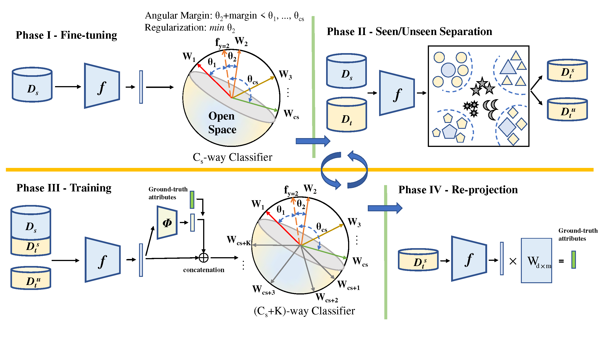

# Interpretable Open-Set Domain Adaptation via Angular Margin Separation (ECCV'22)

## Framework



## Environments

- python == 3.7
- pytorch == 1.2.0
- torchvision == 0.4.0
- numpy, scipy, sklearn, argparse, PIL

## Datasets

Please download the DomainNet dataset, AwA2 dataset, and 3D2 dataset from the following links:

- DomainNet dataset: http://ai.bu.edu/M3SDA/
- AwA2 dataset: https://cvml.ist.ac.at/AwA2/
- 3D2 dataset: https://drive.google.com/file/d/1GdDZ1SvEqGin_zeCAGaJn0821vC_PJmc/view

Please name corresponding folders under your storage path  (e.g.,``·/dataset``) as ``domain_net``, ``Animals_with_Attributes2``, and ``3D2``, respectively.

## Training

### AMS

For training our proposed AMS model, please run ``./exp/run_AMS.sh Your_Storage_Path``. Experimental results will be saved in ``./exp`` by default.

### SR-OSDA

For our reproduced implementation of the [SR-OSDA paper](https://openaccess.thecvf.com/content/ICCV2021/papers/Jing_Towards_Novel_Target_Discovery_Through_Open-Set_Domain_Adaptation_ICCV_2021_paper.pdf), please run `./exp/run_SR_OSDA.sh`. Experimental results will be saved in ``./exp`` by default.

## Citation

It inspires us the most if you would find our work and code helpful. Please consider giving a star :star: and citation. 

```

```

For the SR-OSDA paper, please use the following citation.

```
@inproceedings{jing2021towards,
  title={Towards novel target discovery through open-set domain adaptation},
  author={Jing, Taotao and Liu, Hongfu and Ding, Zhengming},
  booktitle={Proceedings of the IEEE/CVF International Conference on Computer Vision},
  pages={9322--9331},
  year={2021}
}
```

